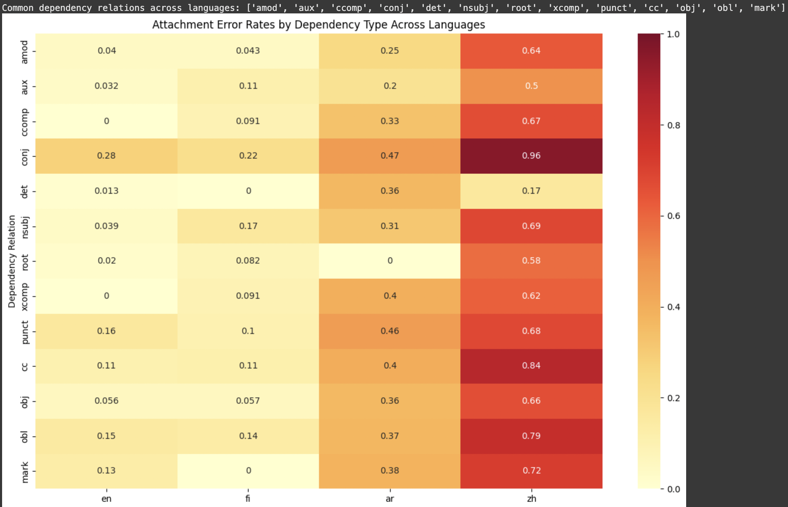

# Cross-Linguistic Analysis of Dependency Parsing Errors

This repository contains code and data for a research project investigating dependency parsing errors across typologically diverse languages using the Universal Dependencies framework.

## Research Overview

This research directly addresses the Universal Dependencies Workshop (UDW) at SyntaxFest 2025 priority area of cross-lingual perspective in parsing analysis. It presents a systematic comparison of parsing errors across four typologically diverse languages:

- **English**: Analytic language with relatively fixed SVO word order and limited morphology
- **Finnish**: Agglutinative Finno-Ugric language with rich morphology and relatively free word order
- **Arabic**: Semitic language with templatic morphology, rich verbal inflection, and VSO word order
- **Chinese**: Isolating, topic-prominent language with minimal morphology

The analysis examines how typological differences impact parsing accuracy, with particular attention to coordination structures, which emerge as universally challenging across all languages studied.

## Key Findings

- A clear typological gradient in parsing difficulty exists, with attachment error rates increasing from languages with more fixed word order and overt morphological cues to those with freer word order or more complex syntactic structures:
  - English: 8.6%
  - Finnish: 12.8% 
  - Arabic: 33.1%
  - Chinese: 66.5%

- Coordination structures (`conj` relations) are universally problematic across languages, with error rates ranging from 28.0% in English to 95.7% in Chinese

- Error patterns correlate with linguistic phenomena:
  - Coordination is most challenging across all languages
  - Subordination is particularly difficult in Chinese and Arabic
  - Function words show the greatest typological variation in error rates

## Repository Structure

- **/code**: Contains the Python implementation of the parsing error analysis
- **/results**: CSV files with detailed error statistics by language and dependency type
- **/visualizations**: Plots showing error patterns and cross-linguistic comparisons
- **requirements.txt**: Required Python packages

## Key Visualization 

*This heatmap shows error rates for common dependency relations across English, Finnish, Arabic, and Chinese. Darker colors indicate higher error rates. Note the universal difficulty of coordination (conj) and the clear gradient in error rates from English to Chinese.*

## Methodology

The analysis uses the Stanza neural parser (Qi et al., 2020) on standard test sets from Universal Dependencies treebanks. The methodology focuses on:

1. Comparing attachment and labeling errors across languages
2. Analyzing error rates by dependency relation type
3. Grouping relations into linguistic phenomena (coordination, subordination, etc.)
4. Measuring error distances to assess locality effects

This approach aligns with the UDW focus areas of "Word segmentation, morphological tagging and syntactic parsing" and "The use of the UD data for evaluating or understanding language models."

## Submission Information

This research is being submitted as a short paper to the 8th Universal Dependencies Workshop (UDW) at SyntaxFest 2025, which takes place August 26-29, 2025.

## Requirements

See requirements.txt for Python dependencies.
